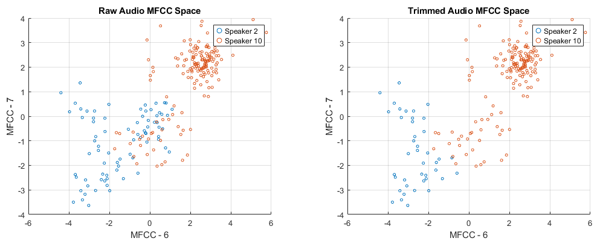
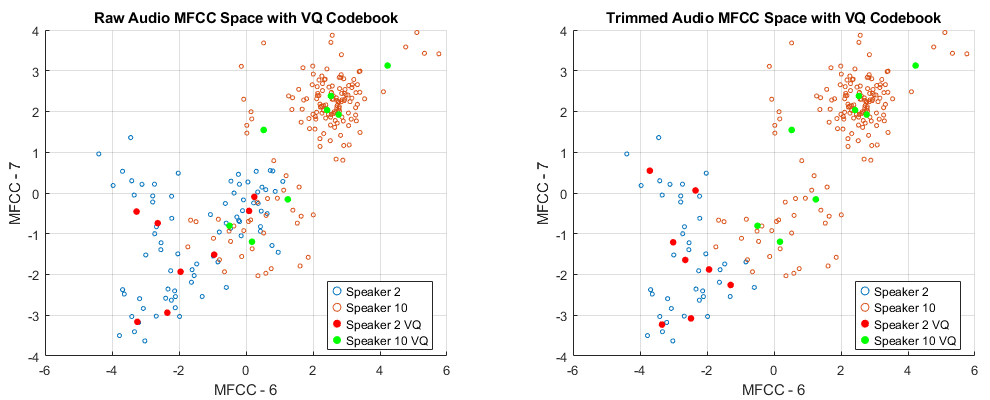

# Sound Recognitor

This is a project for EEC 201 25W.

Team name: '**x**'.

Team members (contribution): **Chenghao Xue** (50%), **Guanyu Mi** (50%).

## File Description

### Files

| Name              | Description                                        |
| ----------------- | -------------------------------------------------- |
| soundrecognitor.m | Main program, used for training and testing data   |
| visualization.m   | For visualization programs                         |
| test9.m           | Specialized program for test 9                     |
| test10a.m         | Specialized program for test 10a                   |
| test10b.m         | Specialized program for test 10b                   |
| mfcc.m            | Function to generate MFCC features                 |
| vq_lbg.m          | Function to get VQ codeword based on LBG algorithm |
| autoTrimSilence.m | Function to remove non-vocal parts of audio        |

### Function parameter description

#### mfcc

- Input:
  - y: Signal
  - Fs: Sample Rate
  - N: Frame size (default: 512)
  - num_mel_filters: Number of Mel filters (default: 20)
  - mfcc_coeff: Number of MFCC coefficients (default: 13)
  - select_coef: Selector for frame filtering based on power (default: 1)
- Output:
  - mfcc_features: Matrix of MFCC features for the selected frames

#### vq_lbg

- Input:
  - mfcc    : MFCC matrix
  - M       : The desired number of codewords in the final codebook (default: 8)
  - epsilon : Splitting parameter (default: 0.01)
  - tol     : Iteration stopping threshold (default: 1e-3)
- Output:
  - codebook: An *M x d* matrix, each row is one final codeword

#### autoTrimSilence

- Input:
  - audioFile       : Path to the input audio file
  - frameSize       : Number of samples in each frame
  - thresholdFactor : The fraction of the maximum energy used as a threshold (default: 0.01)
  - overlapRatio    : Overlap ratio for consecutive frames (default: 2/3)
- Output:
  - trimmedSignal   : Audio signal after removing silent parts from the beginning and the end

## Result
### Speech Preprocessing
#### Test 1
Recognize the sound by human:

| Test case    | s1 | s2 | s3 | s4 | s5 | s6 | s7 | s8 |
| ------------ | -- | -- | -- | -- | -- | -- | -- | -- |
| What I heard | s1 | s2 | s7 | s3 | s4 | s5 | s6 | s7 |

Recognition Rate: 87.50%

#### Test 2

1. Plot the signal to view it in the time domain.

    Sampling rate: 12500 Hz
    Duration of 256 samples: 20.48 milliseconds

    

2. Plot the periodogram by using STFT.

    Frame size N=512: Maximum energy at 355.68 ms and 366.21 Hz

    

    If we extract 80% highest energy, the spectrogram will be

    

---

#### Test 3
lot the mel-spaced filter bank responses.

---

#### Test 4
Cepstrum Calculation

If we extract 80% highest energy, the MFCC will be

---

### Vector Quantization
#### Test 5

We obtain MFCC results for speaker 2 and 10 in the 6th and 7th dimensions.

As shown below, the clustering effect of the trimmed audio is better than that of the original audio.

---

#### Test 6

Then, calculate the VQ codewords in test5 and plot them on the same figure.

---

### Full Test and Demonstration
#### Test 7

Record the prediction results in the dataset **GivenSpeech_Data**.

The autoTrimSilence function is used to preprocess the audio data in both the training and prediction stages.

---

#### Test 8

Then, Add a notch filter to test the system's robustness.

The parameters of  IIR notch filter are: 
- Center frequency ($f_0$) = 1500
- Quality factor ($Q$) = 30
- Pole radius ($R$): 1

---

#### Test 9

---

#### Test 10a
Dataset: **2024StudentAudioRecording**

1. Question 1: If we use "twelve" to identify speakers, what is the accuracy versus the system that uses "zero"? 

    Result: "twelve" and "zero" both have the same accuracy of 100%.

    
    

    ---
2. Question 2: If we use train a whole system that tries to identify a) which speaker, and b) whether the speed is "zero" or "twelve", how accurate is your system?

    Method: We trained a combined VQ codebook, which includes the codebooks for "zero" and "twelve." For the input test set, we compute the distance to each codebook, and the one with the shorter distance corresponds to the respective speech type.

    Result: The Prediction accuracy of both a) and b) is 100%.

    

---

#### Test 10b
Dataset: **EEC201AudioRecordings**

1. Question 3: If we use "eleven" to identify speakers, what is the accuracy versus the system that uses "five"? 

    Result: "five" has a lower accuracy (91.30%), "eleven" has an accuracy of 100%. After manual identification, the timbres of speaker 18 and speaker 13 are very similar, and we believe this is the reason for the prediction error.

    
    

    ---
2. Question 4: How well do they compare against test in 10a using zero/twelve?

    Result: Compared to Question 2 in 10a, its speaker recognition accuracy has decreased. The reason also appears in Question 3, where speaker 18's pronunciation of "five" is mispredicted as speaker 13. 

    
