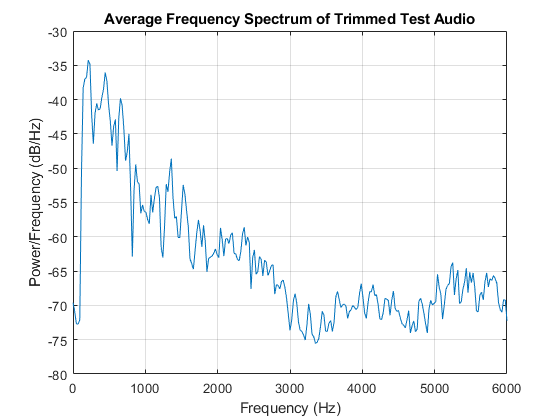

# Sound Recognitor

This is a project for EEC 201 25W.

Team name: '**x**'.

Team members (contribution): **Chenghao Xue** (50%), **Guanyu Mi** (50%).

## File Description

### Files

| Name              | Description                                        |
| ----------------- | -------------------------------------------------- |
| soundrecognitor.m | Main program, used for training and testing data   |
| visualization.m   | For visualization programs                         |
| test9.m           | Specialized program for test 9                     |
| test10a.m         | Specialized program for test 10a                   |
| test10b.m         | Specialized program for test 10b                   |
| disteu.m          | Function to computer Euclidean distances           |
| melfb.m           | Function to compute a mel-filterbank matrix        |
| mfcc.m            | Function to generate MFCC features                 |
| vq_lbg.m          | Function to get VQ codeword based on LBG algorithm |
| autoTrimSilence.m | Function to remove non-vocal parts of audio        |

### Function parameter description

#### mfcc

- Input:
  - y: Signal
  - Fs: Sample Rate
  - N: Frame size (default: 512)
  - num_mel_filters: Number of Mel filters (default: 20)
  - mfcc_coeff: Number of MFCC coefficients (default: 13)
  - select_coef: Selector for frame filtering based on power (default: 1)
- Output:
  - mfcc_features: Matrix of MFCC features for the selected frames

#### vq_lbg

- Input:
  - mfcc    : MFCC matrix
  - M       : The desired number of codewords in the final codebook (default: 8)
  - epsilon : Splitting parameter (default: 0.01)
  - tol     : Iteration stopping threshold (default: 1e-3)
- Output:
  - codebook: An *M x d* matrix, each row is one final codeword

#### autoTrimSilence

- Input:
  - audioFile       : Path to the input audio file
  - frameSize       : Number of samples in each frame
  - thresholdFactor : The fraction of the maximum energy used as a threshold (default: 0.01)
  - overlapRatio    : Overlap ratio for consecutive frames (default: 2/3)
- Output:
  - trimmedSignal   : Audio signal after removing silent parts from the beginning and the end

## Project Tasks

You can use [visualization.m](./visualization.m) to show the results from Test 1 to Test 6.

```shell
matlab -batch "run('visualization.m')"
```

### Speech Preprocessing

### Test 1: Human recognition performance

The goal of this test is to evaluate human performance in recognizing speakers based on voice recordings of the word "zero." This serves as a benchmark for later comparison with machine learning models.

- Played each sound file in the TRAIN folder.
- Played each sound file in the TEST folder in a random order.
- Attempted to identify the speaker manually without checking the ground truth.
- Recorded the recognition rate as a benchmark for comparison with automated methods.

| Test case    | s1 | s2 | s3 | s4 | s5 | s6 | s7 | s8 |
| ------------ | -- | -- | -- | -- | -- | -- | -- | -- |
| What I heard | s1 | s2 | s7 | s3 | s4 | s5 | s6 | s7 |

Recognition Rate: 87.50%

+ I think s3 in the training set hears different from s3 in the test set.

---

### TEST 2: Analyzing Speech Signal

The purpose of this test is to analyze the speech signal by  visualizing the signal in the time domain. The [autoTrimSilence](autoTrimSilence.m) function is also used to trim silence from the signal data, focusing on the voice  segment.

1. **Play Sound in MATLAB:**

   - Used the `sound` function in MATLAB to play the audio file.
2. **Time Duration Calculation:**

   - Given the sampling rate, calculated how many milliseconds of speech are contained in a block of 256 samples using the formula:
     $$
     \text{Duration (ms)} = \frac{256}{\text{Sampling Rate}} \times 1000
     $$

   Sampling rate: 12500 Hz
   Duration of 256 samples: 20.48 milliseconds
3. **Signal Visualization:**

   - Plotted the normalized signal in the time domain to observe its characteristics.
   - We think the silent segment may affect the classification result, so we used the [autoTrimSilence](autoTrimSilence.m) function and 0.01 as the threshold ratio to remove silence from the signal and focus on the voice segment.
   - The untrimmed and trimmed signals were plotted together for comparison.


The trimmed signal removes the silent portions, providing a clearer view of the voice segment, which helps in focusing the analysis on the actual speech data.

4. **STFT:**
   - Tried different frame sizes $ N $ (128, 256, and 512) with frame increment $ M \approx \frac{N}{3} $.
   - Identified the region in the plot that contains most of the energy.
   - Also plot the power spectrum of the trimmed signal.

Frame size N=128: Maximum energy at 605.44 ms and 781.25 Hz
Frame size N=256: Maximum energy at 591.60 ms and 732.42 Hz
Frame size N=512: Maximum energy at 574.56 ms and 756.84 Hz


Since N=512 has the highest frequency resolution, it is the best choice for the frame size.

---

### TEST 3: Mel-Spaced Filter Bank and Spectrum Analysis

The goal of this test is to analyze the mel-spaced filter bank responses and compare them with theoretical triangular filter shapes.

1. **Mel-Spaced Filter Bank Responses:**
   - Used [melfb.m](melfb.m) given to generate the mel filter bank.
   - Plotted the mel-spaced filter bank responses.
   - Compared the plotted responses with the expected theoretical triangular filter shapes.


2. **Spectrum Before and After Mel Wrapping:**
   - Computed and plotted the spectrum after mel wrapping.
   - Compared the mel-wrapped spectrum with the original spectrum.


3. **Effect of Mel Wrapping:**
   - The mel-wrapped spectrum compresses higher frequencies while maintaining resolution in the lower frequency range, which reflects human auditory perception.

---

### Test 4: Cepstrum Calculation and MFCC Function Integration

1. **Cepstrum Calculation:**
   - Applied the Discrete Cosine Transform (DCT) to the log mel spectrum to compute the cepstral coefficients.
   - Kept the first few coefficients and remove the first coefficient.


2. **MFCC Function Integration:**
   - Combined all steps into a single MATLAB function ([mfcc.m](mfcc.m)) to generate MFCC features from an input speech signal.:
     - Preprocessing (silence removal, normalization)
     - Short-Time Fourier Transform (STFT)
     - Mel filter bank processing
     - Logarithmic scaling
     - Cepstrum calculation using DCT
   - Output: MFCC features for each frame of the input speech signal

---

### Vector Quantization

### Test 5: Visualization of MFCC Vector Distribution

We visualize MFCC results for speakers 2 and 10 in the 6th and 7th dimensions.

As shown below, the clustering effect of the trimmed audio is better than that of the original audio.


---

### Test 6: Training a VQ Codebook and Plotting Cluster Centers

Then, calculate the VQ codewords in Test 5 and overlay them on the same figure.


---

### Full Test and Demonstration

Note: 
- All audio used for training and testing has been processed with [autoTrimSilence](autoTrimSilence.m) function, removing non-speech segments.
- The parameters we used for [mfcc](mfcc.m) are:
   - M       : 16
   - epsilon : 0.01
   - tol     : 1e-3
- The parameters we used for [vq_lbg](vq_lbg.m) are:
   - N: 512
   - num_mel_filters: 20
   - mfcc_coeff: 20
   - select_coef: 1

### Test 7: Evaluating System Recognition Accuracy

Dataset: **GivenSpeech_Data**

You can get the results of Test 7 and 8 by running the following command:

```shell
matlab -batch "run('soundrecognitor.m')"
```

Program Flow Description
- Audio Pre-Processing
   - Trim leading and trailing silence (if desired) and normalize the audio.
- Building VQ Codebooks for Each Training Speaker
   - Use the [mfcc](mfcc.m) function to extract MFCC features.
   - Apply the [vq_lbg](vq_lbg.m) function to create a codebook for each speaker.
- Speaker Recognition on the Test Set
   - Extract MFCC features for test files.
   - Compare each test vector's distortion against all speaker codebooks using the [disteu](disteu) function.
   - Select the speaker with the minimum average distortion.
- Performance Evaluation
   - Calculate the recognition rate by comparing predicted vs. true speaker labels.

```shell
True Speaker: 1, Predicted Speaker: 1
True Speaker: 2, Predicted Speaker: 2
True Speaker: 3, Predicted Speaker: 3
True Speaker: 4, Predicted Speaker: 4
True Speaker: 5, Predicted Speaker: 5
True Speaker: 6, Predicted Speaker: 6
True Speaker: 7, Predicted Speaker: 7
True Speaker: 8, Predicted Speaker: 8
Overall Recognition Rate: 100.00%
```

---

### Test 8: Assessing System Robustness with Notch-Filtered Voice Signals

Then, repeat Test 7 by adding the notch filter to test the robustness of the system.

We visualized the average frequency spectrum of the test set, and therefore selected multiple $f_0$ values to test in order to maximize interference.



The final parameters of the IIR notch filter we selected are:

- Center frequency ($f_0$) = [500, 1000, 1500, 2500]
- Quality factor ($Q$) = 30
- Pole radius ($R$): 1

Accuracies for all cases are 100%.

```shell
f0: 500
True Speaker: 1, Predicted Speaker (Notch Filtered): 1
True Speaker: 2, Predicted Speaker (Notch Filtered): 2
True Speaker: 3, Predicted Speaker (Notch Filtered): 3
True Speaker: 4, Predicted Speaker (Notch Filtered): 4
True Speaker: 5, Predicted Speaker (Notch Filtered): 5
True Speaker: 6, Predicted Speaker (Notch Filtered): 6
True Speaker: 7, Predicted Speaker (Notch Filtered): 7
True Speaker: 8, Predicted Speaker (Notch Filtered): 8
Overall Recognition Rate: 100.00%

f0: 1000
True Speaker: 1, Predicted Speaker (Notch Filtered): 1
True Speaker: 2, Predicted Speaker (Notch Filtered): 2
True Speaker: 3, Predicted Speaker (Notch Filtered): 3
True Speaker: 4, Predicted Speaker (Notch Filtered): 4
True Speaker: 5, Predicted Speaker (Notch Filtered): 5
True Speaker: 6, Predicted Speaker (Notch Filtered): 6
True Speaker: 7, Predicted Speaker (Notch Filtered): 7
True Speaker: 8, Predicted Speaker (Notch Filtered): 8
Overall Recognition Rate: 100.00%

f0: 1500
True Speaker: 1, Predicted Speaker (Notch Filtered): 1
True Speaker: 2, Predicted Speaker (Notch Filtered): 2
True Speaker: 3, Predicted Speaker (Notch Filtered): 3
True Speaker: 4, Predicted Speaker (Notch Filtered): 4
True Speaker: 5, Predicted Speaker (Notch Filtered): 5
True Speaker: 6, Predicted Speaker (Notch Filtered): 6
True Speaker: 7, Predicted Speaker (Notch Filtered): 7
True Speaker: 8, Predicted Speaker (Notch Filtered): 8
Overall Recognition Rate: 100.00%

f0: 2500
True Speaker: 1, Predicted Speaker (Notch Filtered): 1
True Speaker: 2, Predicted Speaker (Notch Filtered): 2
True Speaker: 3, Predicted Speaker (Notch Filtered): 3
True Speaker: 4, Predicted Speaker (Notch Filtered): 4
True Speaker: 5, Predicted Speaker (Notch Filtered): 5
True Speaker: 6, Predicted Speaker (Notch Filtered): 6
True Speaker: 7, Predicted Speaker (Notch Filtered): 7
True Speaker: 8, Predicted Speaker (Notch Filtered): 8
Overall Recognition Rate: 100.00%
```

---

### Test 9: Assessing System Robustness with Non-Student Voices

You can get the results of Test 9 by running the following command:

```shell
matlab -batch "run('test9.m')"
```

Then, you will first get speakers used in the training set, including 10 speakers randomly chosen from **2024StudentAudioRecording** , and then the true and predicted speakers for each test file, and finally the overall recognition rate.

```
Speaker used in training set:
2024 student s19
2024 student s10
2024 student s17
2024 student s6
2024 student s2
2024 student s11
2024 student s15
2024 student s13
2024 student s8
2024 student s14
non-student s1
non-student s2
non-student s3
non-student s4
non-student s5
non-student s6
non-student s7
non-student s8
non-student s9
non-student s10
non-student s11

True Speaker: 2024 student s19, Predicted Speaker: 2024 student s19
True Speaker: 2024 student s10, Predicted Speaker: 2024 student s10
True Speaker: 2024 student s17, Predicted Speaker: 2024 student s17
True Speaker: 2024 student s6, Predicted Speaker: 2024 student s6
True Speaker: 2024 student s2, Predicted Speaker: 2024 student s2
True Speaker: 2024 student s11, Predicted Speaker: 2024 student s11
True Speaker: 2024 student s15, Predicted Speaker: 2024 student s15
True Speaker: 2024 student s13, Predicted Speaker: 2024 student s13
True Speaker: 2024 student s8, Predicted Speaker: 2024 student s8
True Speaker: 2024 student s14, Predicted Speaker: 2024 student s14
True Speaker: non-student s1, Predicted Speaker: non-student s1
True Speaker: non-student s2, Predicted Speaker: non-student s2
True Speaker: non-student s3, Predicted Speaker: non-student s7
True Speaker: non-student s4, Predicted Speaker: non-student s4
True Speaker: non-student s5, Predicted Speaker: non-student s5
True Speaker: non-student s6, Predicted Speaker: non-student s6
True Speaker: non-student s7, Predicted Speaker: non-student s7
True Speaker: non-student s8, Predicted Speaker: non-student s8
Overall Recognition Rate: 94.44%
```

---

### Test 10a: Speaker Identification Using “Zero” and “Twelve” Sounds

Dataset: **2024StudentAudioRecording**

You can get the results of Test 10a by running the following command:

```shell
matlab -batch "run('test10a.m')"
```

1. Question 1: If we use "twelve" to identify speakers, what is the accuracy versus the system that uses "zero"?

   Result: "twelve" and "zero" both have the same accuracy of 100%.

   ```
   Test ("Zero") - True Speaker: 1, Predicted: 1
   Test ("Zero") - True Speaker: 2, Predicted: 2
   Test ("Zero") - True Speaker: 3, Predicted: 3
   Test ("Zero") - True Speaker: 4, Predicted: 4
   Test ("Zero") - True Speaker: 6, Predicted: 6
   Test ("Zero") - True Speaker: 7, Predicted: 7
   Test ("Zero") - True Speaker: 8, Predicted: 8
   Test ("Zero") - True Speaker: 9, Predicted: 9
   Test ("Zero") - True Speaker: 10, Predicted: 10
   Test ("Zero") - True Speaker: 11, Predicted: 11
   Test ("Zero") - True Speaker: 12, Predicted: 12
   Test ("Zero") - True Speaker: 13, Predicted: 13
   Test ("Zero") - True Speaker: 14, Predicted: 14
   Test ("Zero") - True Speaker: 15, Predicted: 15
   Test ("Zero") - True Speaker: 16, Predicted: 16
   Test ("Zero") - True Speaker: 17, Predicted: 17
   Test ("Zero") - True Speaker: 18, Predicted: 18
   Test ("Zero") - True Speaker: 19, Predicted: 19
   "Zero" Test Accuracy: 100.00%

   Test ("Twelve") - True Speaker: 1, Predicted: 1
   Test ("Twelve") - True Speaker: 2, Predicted: 2
   Test ("Twelve") - True Speaker: 3, Predicted: 3
   Test ("Twelve") - True Speaker: 4, Predicted: 4
   Test ("Twelve") - True Speaker: 6, Predicted: 6
   Test ("Twelve") - True Speaker: 7, Predicted: 7
   Test ("Twelve") - True Speaker: 8, Predicted: 8
   Test ("Twelve") - True Speaker: 9, Predicted: 9
   Test ("Twelve") - True Speaker: 10, Predicted: 10
   Test ("Twelve") - True Speaker: 11, Predicted: 11
   Test ("Twelve") - True Speaker: 12, Predicted: 12
   Test ("Twelve") - True Speaker: 13, Predicted: 13
   Test ("Twelve") - True Speaker: 14, Predicted: 14
   Test ("Twelve") - True Speaker: 15, Predicted: 15
   Test ("Twelve") - True Speaker: 16, Predicted: 16
   Test ("Twelve") - True Speaker: 17, Predicted: 17
   Test ("Twelve") - True Speaker: 18, Predicted: 18
   Test ("Twelve") - True Speaker: 19, Predicted: 19
   "Twelve" Test Accuracy: 100.00%
   ```

   ---
2. Question 2: If we use train a whole system that tries to identify a) which speaker, and b) whether the speed is "zero" or "twelve", how accurate is your system?

   Method: We trained a combined VQ codebook, which includes the codebooks for "zero" and "twelve." For the input test set, we compute the distance to each codebook, and the one with the shorter distance corresponds to the respective speech type.

   Result: The Prediction accuracy of both a) and b) is 100%.

   ```
   Combined Test (Zero) - True: (Speaker 1, zero), Predicted: (Speaker 1, zero)
   Combined Test (Zero) - True: (Speaker 2, zero), Predicted: (Speaker 2, zero)
   Combined Test (Zero) - True: (Speaker 3, zero), Predicted: (Speaker 3, zero)
   Combined Test (Zero) - True: (Speaker 4, zero), Predicted: (Speaker 4, zero)
   Combined Test (Zero) - True: (Speaker 6, zero), Predicted: (Speaker 6, zero)
   Combined Test (Zero) - True: (Speaker 7, zero), Predicted: (Speaker 7, zero)
   Combined Test (Zero) - True: (Speaker 8, zero), Predicted: (Speaker 8, zero)
   Combined Test (Zero) - True: (Speaker 9, zero), Predicted: (Speaker 9, zero)
   Combined Test (Zero) - True: (Speaker 10, zero), Predicted: (Speaker 10, zero)
   Combined Test (Zero) - True: (Speaker 11, zero), Predicted: (Speaker 11, zero)
   Combined Test (Zero) - True: (Speaker 12, zero), Predicted: (Speaker 12, zero)
   Combined Test (Zero) - True: (Speaker 13, zero), Predicted: (Speaker 13, zero)
   Combined Test (Zero) - True: (Speaker 14, zero), Predicted: (Speaker 14, zero)
   Combined Test (Zero) - True: (Speaker 15, zero), Predicted: (Speaker 15, zero)
   Combined Test (Zero) - True: (Speaker 16, zero), Predicted: (Speaker 16, zero)
   Combined Test (Zero) - True: (Speaker 17, zero), Predicted: (Speaker 17, zero)
   Combined Test (Zero) - True: (Speaker 18, zero), Predicted: (Speaker 18, zero)
   Combined Test (Zero) - True: (Speaker 19, zero), Predicted: (Speaker 19, zero)
   Combined Test (Twelve) - True: (Speaker 1, twelve), Predicted: (Speaker 1, twelve)
   Combined Test (Twelve) - True: (Speaker 2, twelve), Predicted: (Speaker 2, twelve)
   Combined Test (Twelve) - True: (Speaker 3, twelve), Predicted: (Speaker 3, twelve)
   Combined Test (Twelve) - True: (Speaker 4, twelve), Predicted: (Speaker 4, twelve)
   Combined Test (Twelve) - True: (Speaker 6, twelve), Predicted: (Speaker 6, twelve)
   Combined Test (Twelve) - True: (Speaker 7, twelve), Predicted: (Speaker 7, twelve)
   Combined Test (Twelve) - True: (Speaker 8, twelve), Predicted: (Speaker 8, twelve)
   Combined Test (Twelve) - True: (Speaker 9, twelve), Predicted: (Speaker 9, twelve)
   Combined Test (Twelve) - True: (Speaker 10, twelve), Predicted: (Speaker 10, twelve)
   Combined Test (Twelve) - True: (Speaker 11, twelve), Predicted: (Speaker 11, twelve)
   Combined Test (Twelve) - True: (Speaker 12, twelve), Predicted: (Speaker 12, twelve)
   Combined Test (Twelve) - True: (Speaker 13, twelve), Predicted: (Speaker 13, twelve)
   Combined Test (Twelve) - True: (Speaker 14, twelve), Predicted: (Speaker 14, twelve)
   Combined Test (Twelve) - True: (Speaker 15, twelve), Predicted: (Speaker 15, twelve)
   Combined Test (Twelve) - True: (Speaker 16, twelve), Predicted: (Speaker 16, twelve)
   Combined Test (Twelve) - True: (Speaker 17, twelve), Predicted: (Speaker 17, twelve)
   Combined Test (Twelve) - True: (Speaker 18, twelve), Predicted: (Speaker 18, twelve)
   Combined Test (Twelve) - True: (Speaker 19, twelve), Predicted: (Speaker 19, twelve)
   Combined System - Speaker Accuracy: 100.00%
   Combined System - Word Accuracy: 100.00%
   Combined System - Joint (Speaker & Word) Accuracy: 100.00%
   ```

---

### Test 10b: Speaker Identification Using “Five” and “Eleven” Sounds

Dataset: **EEC201AudioRecordings**

You can get the results of Test 10b by running the following command:

```shell
matlab -batch "run('test10b.m')"
```

1. Question 3: If we use "eleven" to identify speakers, what is the accuracy versus the system that uses "five"?

   Result: "five" has a lower accuracy (91.30%), "eleven" has an accuracy of 100%. After manual identification, the timbres of speaker 18 and speaker 13 are very similar, and we believe this is the reason for the prediction error.

   ```
   Test ("Eleven") - True Speaker: 1, Predicted: 1
   Test ("Eleven") - True Speaker: 2, Predicted: 2
   Test ("Eleven") - True Speaker: 3, Predicted: 3
   Test ("Eleven") - True Speaker: 4, Predicted: 4
   Test ("Eleven") - True Speaker: 5, Predicted: 5
   Test ("Eleven") - True Speaker: 6, Predicted: 6
   Test ("Eleven") - True Speaker: 7, Predicted: 7
   Test ("Eleven") - True Speaker: 8, Predicted: 8
   Test ("Eleven") - True Speaker: 9, Predicted: 9
   Test ("Eleven") - True Speaker: 10, Predicted: 10
   Test ("Eleven") - True Speaker: 11, Predicted: 11
   Test ("Eleven") - True Speaker: 12, Predicted: 12
   Test ("Eleven") - True Speaker: 13, Predicted: 13
   Test ("Eleven") - True Speaker: 14, Predicted: 14
   Test ("Eleven") - True Speaker: 15, Predicted: 15
   Test ("Eleven") - True Speaker: 16, Predicted: 16
   Test ("Eleven") - True Speaker: 17, Predicted: 17
   Test ("Eleven") - True Speaker: 18, Predicted: 18
   Test ("Eleven") - True Speaker: 19, Predicted: 19
   Test ("Eleven") - True Speaker: 20, Predicted: 20
   Test ("Eleven") - True Speaker: 21, Predicted: 21
   Test ("Eleven") - True Speaker: 22, Predicted: 22
   Test ("Eleven") - True Speaker: 23, Predicted: 23
   "Eleven" Test Accuracy: 100.00%

   Test ("Five") - True Speaker: 1, Predicted: 1
   Test ("Five") - True Speaker: 2, Predicted: 2
   Test ("Five") - True Speaker: 3, Predicted: 3
   Test ("Five") - True Speaker: 4, Predicted: 4
   Test ("Five") - True Speaker: 5, Predicted: 5
   Test ("Five") - True Speaker: 6, Predicted: 6
   Test ("Five") - True Speaker: 7, Predicted: 7
   Test ("Five") - True Speaker: 8, Predicted: 8
   Test ("Five") - True Speaker: 9, Predicted: 9
   Test ("Five") - True Speaker: 10, Predicted: 10
   Test ("Five") - True Speaker: 11, Predicted: 11
   Test ("Five") - True Speaker: 12, Predicted: 12
   Test ("Five") - True Speaker: 13, Predicted: 13
   Test ("Five") - True Speaker: 14, Predicted: 14
   Test ("Five") - True Speaker: 15, Predicted: 15
   Test ("Five") - True Speaker: 16, Predicted: 16
   Test ("Five") - True Speaker: 17, Predicted: 17
   Test ("Five") - True Speaker: 18, Predicted: 13
   Test ("Five") - True Speaker: 19, Predicted: 19
   Test ("Five") - True Speaker: 20, Predicted: 20
   Test ("Five") - True Speaker: 21, Predicted: 21
   Test ("Five") - True Speaker: 22, Predicted: 22
   Test ("Five") - True Speaker: 23, Predicted: 23
   "Five" Test Accuracy: 95.65%
   ```

   ---
2. Question 4: How well do they compare against test in 10a using zero/twelve?

   Result: Compared to Question 2 in 10a, its speaker recognition accuracy has decreased. The reason also appears in Question 3, where speaker 18's pronunciation of "five" is mispredicted as speaker 13.

   ```
   Combined Test (Eleven) - True: (Speaker 1, eleven), Predicted: (Speaker 1, eleven)
   Combined Test (Eleven) - True: (Speaker 2, eleven), Predicted: (Speaker 2, eleven)
   Combined Test (Eleven) - True: (Speaker 3, eleven), Predicted: (Speaker 3, eleven)
   Combined Test (Eleven) - True: (Speaker 4, eleven), Predicted: (Speaker 4, eleven)
   Combined Test (Eleven) - True: (Speaker 5, eleven), Predicted: (Speaker 5, eleven)
   Combined Test (Eleven) - True: (Speaker 6, eleven), Predicted: (Speaker 6, eleven)
   Combined Test (Eleven) - True: (Speaker 7, eleven), Predicted: (Speaker 7, eleven)
   Combined Test (Eleven) - True: (Speaker 8, eleven), Predicted: (Speaker 8, eleven)
   Combined Test (Eleven) - True: (Speaker 9, eleven), Predicted: (Speaker 9, eleven)
   Combined Test (Eleven) - True: (Speaker 10, eleven), Predicted: (Speaker 10, eleven)
   Combined Test (Eleven) - True: (Speaker 11, eleven), Predicted: (Speaker 11, eleven)
   Combined Test (Eleven) - True: (Speaker 12, eleven), Predicted: (Speaker 12, eleven)
   Combined Test (Eleven) - True: (Speaker 13, eleven), Predicted: (Speaker 13, eleven)
   Combined Test (Eleven) - True: (Speaker 14, eleven), Predicted: (Speaker 14, eleven)
   Combined Test (Eleven) - True: (Speaker 15, eleven), Predicted: (Speaker 15, eleven)
   Combined Test (Eleven) - True: (Speaker 16, eleven), Predicted: (Speaker 16, eleven)
   Combined Test (Eleven) - True: (Speaker 17, eleven), Predicted: (Speaker 17, eleven)
   Combined Test (Eleven) - True: (Speaker 18, eleven), Predicted: (Speaker 18, eleven)
   Combined Test (Eleven) - True: (Speaker 19, eleven), Predicted: (Speaker 19, eleven)
   Combined Test (Eleven) - True: (Speaker 20, eleven), Predicted: (Speaker 20, eleven)
   Combined Test (Eleven) - True: (Speaker 21, eleven), Predicted: (Speaker 21, eleven)
   Combined Test (Eleven) - True: (Speaker 22, eleven), Predicted: (Speaker 22, eleven)
   Combined Test (Eleven) - True: (Speaker 23, eleven), Predicted: (Speaker 23, eleven)
   Combined Test (Five) - True: (Speaker 1, five), Predicted: (Speaker 1, five)
   Combined Test (Five) - True: (Speaker 2, five), Predicted: (Speaker 2, five)
   Combined Test (Five) - True: (Speaker 3, five), Predicted: (Speaker 3, five)
   Combined Test (Five) - True: (Speaker 4, five), Predicted: (Speaker 4, five)
   Combined Test (Five) - True: (Speaker 5, five), Predicted: (Speaker 5, five)
   Combined Test (Five) - True: (Speaker 6, five), Predicted: (Speaker 6, five)
   Combined Test (Five) - True: (Speaker 7, five), Predicted: (Speaker 7, five)
   Combined Test (Five) - True: (Speaker 8, five), Predicted: (Speaker 8, five)
   Combined Test (Five) - True: (Speaker 9, five), Predicted: (Speaker 9, five)
   Combined Test (Five) - True: (Speaker 10, five), Predicted: (Speaker 10, five)
   Combined Test (Five) - True: (Speaker 11, five), Predicted: (Speaker 11, five)
   Combined Test (Five) - True: (Speaker 12, five), Predicted: (Speaker 12, five)
   Combined Test (Five) - True: (Speaker 13, five), Predicted: (Speaker 13, five)
   Combined Test (Five) - True: (Speaker 14, five), Predicted: (Speaker 14, five)
   Combined Test (Five) - True: (Speaker 15, five), Predicted: (Speaker 15, five)
   Combined Test (Five) - True: (Speaker 16, five), Predicted: (Speaker 16, five)
   Combined Test (Five) - True: (Speaker 17, five), Predicted: (Speaker 17, five)
   Combined Test (Five) - True: (Speaker 18, five), Predicted: (Speaker 13, five)
   Combined Test (Five) - True: (Speaker 19, five), Predicted: (Speaker 19, five)
   Combined Test (Five) - True: (Speaker 20, five), Predicted: (Speaker 20, five)
   Combined Test (Five) - True: (Speaker 21, five), Predicted: (Speaker 21, five)
   Combined Test (Five) - True: (Speaker 22, five), Predicted: (Speaker 22, five)
   Combined Test (Five) - True: (Speaker 23, five), Predicted: (Speaker 23, five)
   Combined System - Speaker Accuracy: 97.83%
   Combined System - Word Accuracy: 100.00%
   Combined System - Joint (Speaker & Word) Accuracy: 97.83%
   ```
