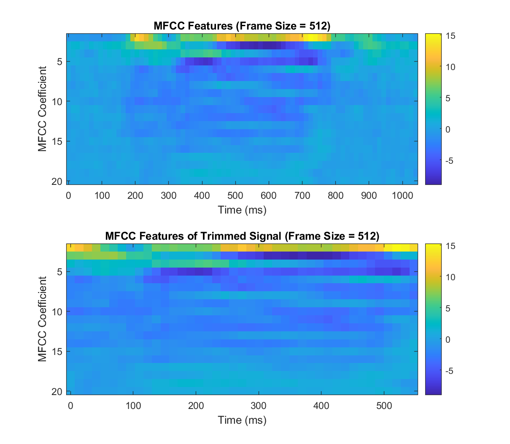

# Sound Recognitor

This is a project for EEC 201 25W.

Team name: '**x**'

Team members: **Chenghao Xue**, **Guanyu Mi**.

## File Description

### Files

| Name              | Description                                        |
| ----------------- | -------------------------------------------------- |
| soundrecognitor.m | Main program, used for training and testing data   |
| visualization.m   | For visualization programs                         |
| mfcc.m            | Function to generate MFCC features                 |
| vq_lbg.m          | Function to get VQ codeword based on LBG algorithm |

### Function parameter description

#### mfcc

- Input:
  - inputData: Audio file or Signal
  - N: Frame size (default: 512)
  - num_mel_filters: Number of Mel filters (default: 20)
  - mfcc_coeff: Number of MFCC coefficients (default: 13)
  - select_coef: Selector for frame filtering based on power (default: 1)
- Output:
  - mfcc_features: Matrix of MFCC features for the selected frames

#### vq_lbg

- Input:
  - mfcc    : MFCC matrix
  - M       : The desired number of codewords in the final codebook (default: 8)
  - epsilon : Splitting parameter (default: 0.01)
  - tol     : Iteration stopping threshold (default: 1e-3)
- Output:
  - codebook: An *M x d* matrix, each row is one final codeword

## Result

### Test 1

| Test case    | s1 | s2 | s3 | s4 | s5 | s6 | s7 | s8 |
| ------------ | -- | -- | -- | -- | -- | -- | -- | -- |
| What I heard | s1 | s2 | s7 | s3 | s4 | s5 | s6 | s7 |

Recognition Rate: 87.50%

---

### Test 2

Sampling rate: 12500 Hz
Duration of 256 samples: 20.48 milliseconds


Frame size N=512: Maximum energy at 355.68 ms and 366.21 Hz


If we extract 80% highest energy, the spectrogram will be


---

### Test 3


---

### Test 4



If we extract 80% highest energy, the MFCC will be


---

### Test 5

MFCC results for speaker 2 and 10 in 6 and 7 dimensions.


---

### Test 6

Calculate the VQ codewords in test5 and plot them on the same figure.


---

### Test 7

Prediction results.


---

### Test 8

Predict the result after notch filter.


---

### Test 9

```
Speaker used in training set:
2024 student s19
2024 student s10
2024 student s17
2024 student s6
2024 student s2
2024 student s11
2024 student s15
2024 student s13
2024 student s8
2024 student s14
non-student s1
non-student s2
non-student s3
non-student s4
non-student s5
non-student s6
non-student s7
non-student s8
non-student s9
non-student s10
non-student s11

True Speaker: 2024 student s19, Predicted Speaker: 2024 student s19
True Speaker: 2024 student s10, Predicted Speaker: 2024 student s10
True Speaker: 2024 student s17, Predicted Speaker: 2024 student s17
True Speaker: 2024 student s6, Predicted Speaker: 2024 student s6
True Speaker: 2024 student s2, Predicted Speaker: 2024 student s2
True Speaker: 2024 student s11, Predicted Speaker: 2024 student s11
True Speaker: 2024 student s15, Predicted Speaker: 2024 student s15
True Speaker: 2024 student s13, Predicted Speaker: 2024 student s13
True Speaker: 2024 student s8, Predicted Speaker: 2024 student s8
True Speaker: 2024 student s14, Predicted Speaker: 2024 student s14
True Speaker: non-student s1, Predicted Speaker: non-student s1
True Speaker: non-student s2, Predicted Speaker: non-student s2
True Speaker: non-student s3, Predicted Speaker: non-student s7
True Speaker: non-student s4, Predicted Speaker: non-student s4
True Speaker: non-student s5, Predicted Speaker: non-student s5
True Speaker: non-student s6, Predicted Speaker: non-student s6
True Speaker: non-student s7, Predicted Speaker: non-student s7
True Speaker: non-student s8, Predicted Speaker: non-student s8
Overall Recognition Rate: 94.44%
```

### Test 10a

Question 1:


Question 2:


---

### Test 10b

Question 3:


Question 4:


